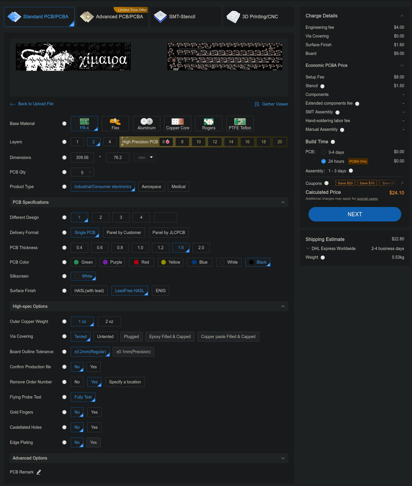
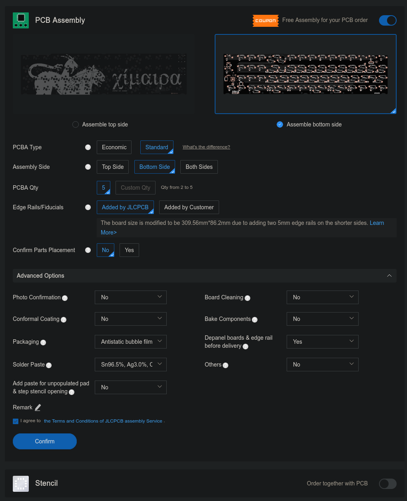
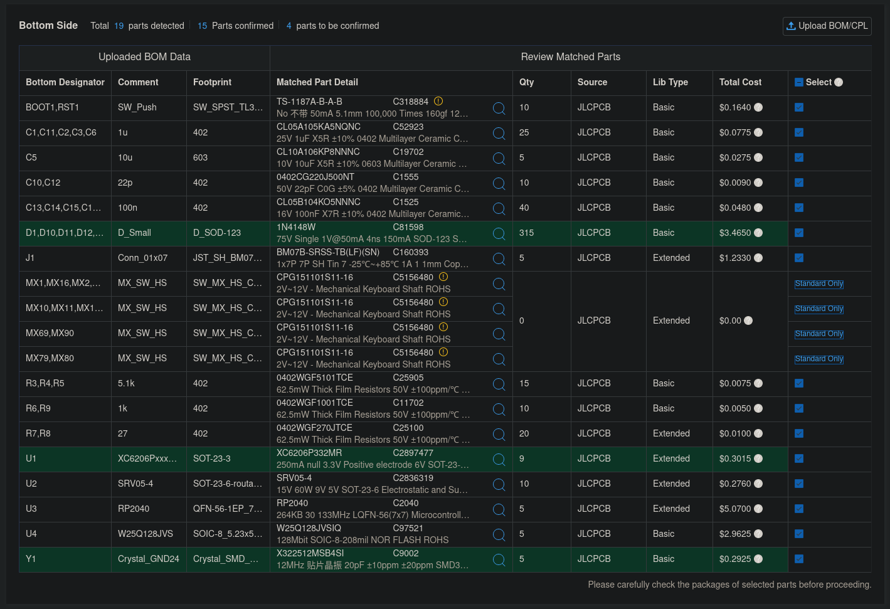
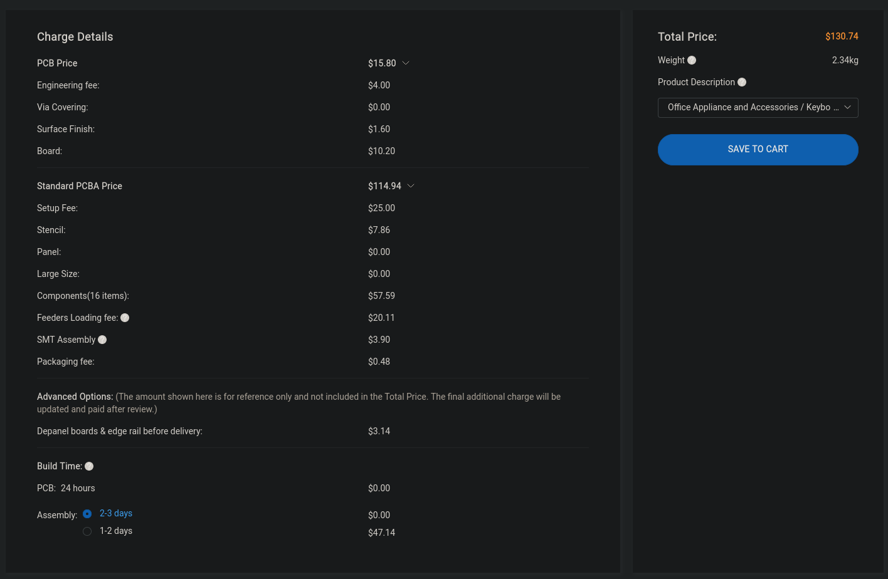

# JLCPCB Order Information

These were the settings used for the original production run for personal use. The PCB files have been updated since the first run to correct some solder mask issues based on JLC engineers' advice, and should be able to be ordered as-is, but no guarantees or warranties are made.

