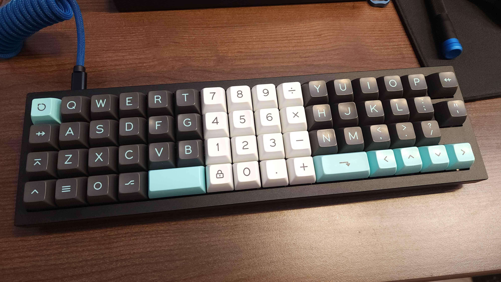
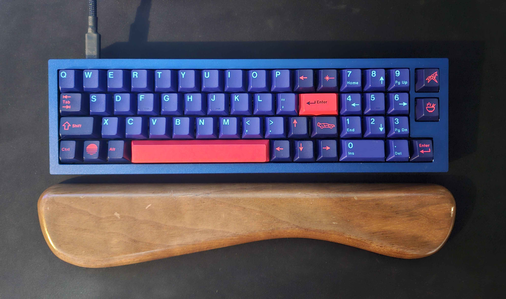
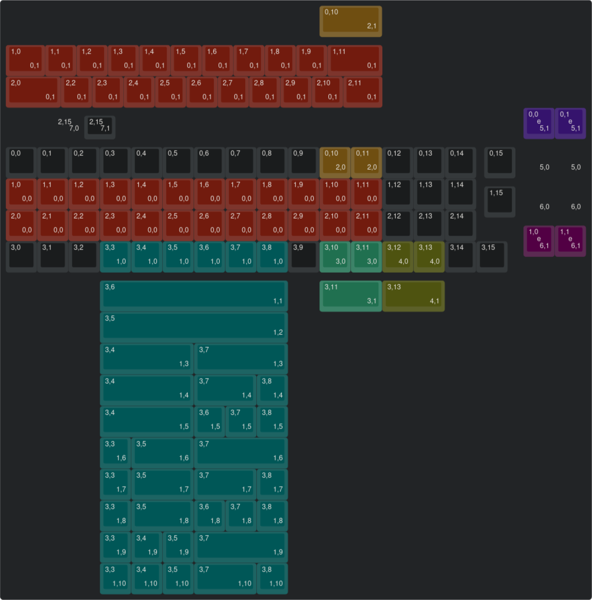
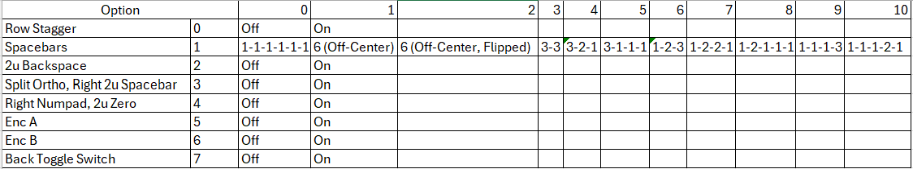

# Q9 Chimera

Q9 Chimera is an RP2040-based, drop-in, multi-layout replacement PCB for Keychron Q9. Supports ortholinear layout with central or right-hand numpad, and traditional row-stagger with right hand numpad. Supports up to two independent EC11 rotary encoders in the separated key positions. 6u spacebar option supports off-center switch position in either the standard orientation or flipped.

*xomm's split ortho build*

*baconspoon's row-staggered build*

## Hardware

* Keyboard Maintainer: [xomm](https://github.com/xommmmmmmm) and [baconspoon](https://github.com/baconspoon85)
* Hardware Supported: Keychron Q9, Keychron Q9 Plus cases with Q9 Chimera PCB
* Hardware Availability: Case from [Keychron](https://www.keychron.com/products/keychron-q9-qmk-custom-mechanical-keyboard), Open-source PCB orderable from JLCPCB using provided [production files](https://github.com/xommmmmmmm/QueueNineChimera/tree/main/Q9-Chimera/Q9-Chimera-PCB/production). Production files should be orderable as-is and have been used successfully for PCBA, but no guarantees or warranties are made. 

This project is not affiliated with or endorsed by Keychron or JLCPCB.

### Assembly Notes

- The universal FR4 plate is softer than the original steel plate, so you may need to pull up the plate when inserting switches, or use a plate fork to ensure switches are fully seated.
- The original foam gaskets can be removed cleanly with care and reused on the Chimera PCB.

## Firmware

Vial firmware source can be found [here](https://github.com/xommmmmmmm/vial-qmk/tree/vial/keyboards/xomm/q9_chimera). A pre-compiled firmware can be found [here](https://github.com/xommmmmmmm/QueueNineChimera/tree/main/firmware/xomm_q9_chimera_vial.uf2).

# Q9 Chimera keymap options

All sockets for all layout options can be populated during PCB assembly, including the ones under the encoders.

[Keyboard Layout Editor gist](http://www.keyboard-layout-editor.com/#/gists/b5c5bf3bcd11c2a14bd86eb9c05d4cf7)

## Options

The images at the top use the following options:
- xomm's split ortho layout:
  - Spacebar option 8: 1-2-1-1-1
  - Split Ortho, Right 2u Spacebar
- baconspoon's row-staggered layout:
  - Row Stagger
  - Spacebar option 2: 6 (off-center, flipped)
  - Right Numpad, 2u Zero

The default keymap is provided as barebones due to the number of possible layouts, and should be edited as desired. Remember to export your .vil from Vial GUI once satisfied for safekeeping.

## Credits and helpful things

- Big thanks to baconspoon for validating the design, contributing plate/edge cuts, additional layouts, and a ton of other help.
- Noah Kiser's [TKL RP2040 PCB Design](https://www.youtube.com/watch?v=6Z49bynRqj8&list=PLstjCi968EZftHZSitvqiVnyZ1CbmptIB) series
- Joe Scotto's [PCB Design](https://www.youtube.com/watch?v=7LyziNdFlew&list=PLBD2IS_t_iWZDMdG_ZF57x9Ebm3kxKqxF) series