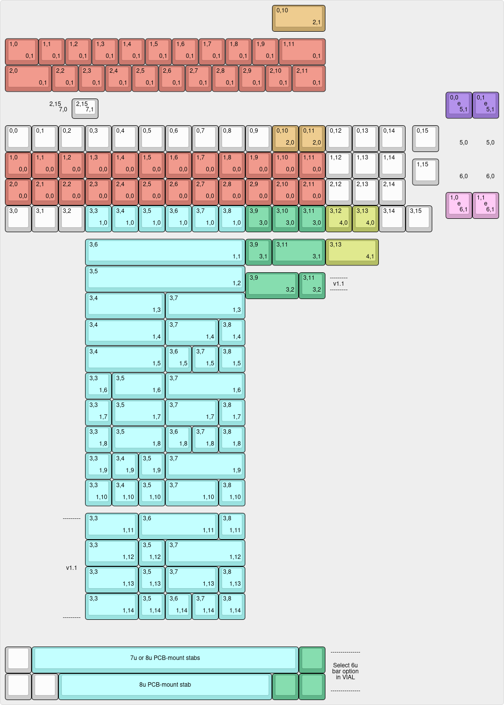
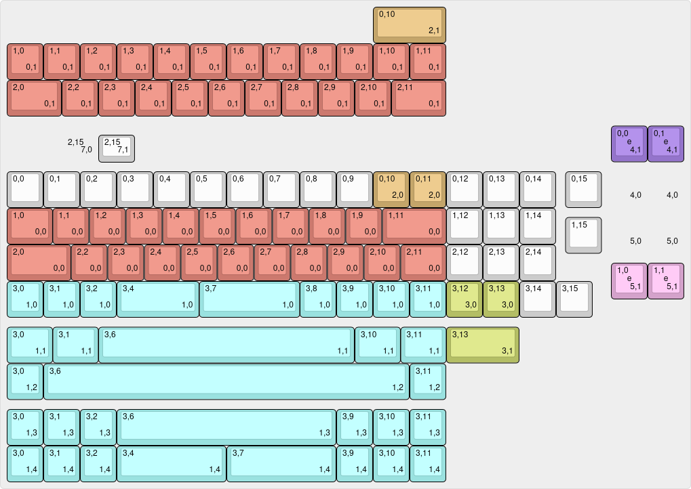

# Q9 Chimera & Limousine

Q9 Chimera & Limousine are RP2040-based, drop-in, multi-layout replacement PCBs for Keychron Q9. Chimera supports ortholinear layout with central or right-hand numpad, and traditional row-stagger with right hand numpad. Limousine supports row and alpha stagger, with support for 2.25u/2.75u "Alice" bars and right-hand numpad.

Both versions support up to two independent EC11 rotary encoders in the separated key positions, and a plethora of bottom-row options.

*xomm's split ortho build*

*baconspoon's row-staggered build*

## Hardware

* Keyboard Maintainer: [xomm](https://github.com/xommmmmmmm) and [baconspoon](https://github.com/baconspoon85)
* Hardware Supported: Keychron Q9, Keychron Q9 Plus cases with Q9 Chimera PCB
* Hardware Availability: Case from [Keychron](https://www.keychron.com/products/keychron-q9-qmk-custom-mechanical-keyboard), Open-source PCB orderable from JLCPCB using provided production files in their respective subfolders. Production files should be orderable as-is and have been used successfully for PCBA, but no guarantees or warranties are made. 

This project is not affiliated with or endorsed by Keychron or JLCPCB.

### Build Guide

**Disassembly**:
1. If you have keycaps on the board, remove them before disassembly to avoid scratching them against the case.
1. Flip the board upside down and unscrew the six H2.5 screws on the bottom case to remove it.
1. Disconnect the JST connector from the original board
1. Lift the assembly out by lifting from the bottom (spacebar side) first, then pull it out from under the daughterboard. Take care not to lose the 3 plastic caps from the pegs on the top case.

**Test the new PCB**:
1. Insert 2 switches in the top left for unlocking the board.
1. Connect the JST from the daughterboard to the new board.
1. Taking care to not short any board components on the top case, connect the USB-C to your PC.
1. Open https://vial.rocks/ to validate that it is detected.
1. Open the matrix tester and use tweezers or a switch puller to check sockets.
1. Disconnect USB-C once done, then disconnect the JST.

**PCB Assembly**:
1. If you have a barebones PCB and/or want to add EC11 encoder(s), now is the time to solder. 
    1. If you are not using encoder(s), and you originally purchased the Q9 with one, remove the PH1 screws holding in the encoder blocker from the top case. 
1. Add any PCB-mounted stabilizers you will be using. If your switches have minimal wobble, you generally won't need 2u stabilizers.  
    1. Limousine note: If you chose to have Mill-Max sockets soldered for 3u spacebars, you will need to desolder one of the Kailh hotswap sockets to access a 3u stabilizer hole. Conversely, the 3u Mill-Max sockets sit under the stabilizers of other footprints, so you may want to add pads under your stabilizers to reduce the bottom-out noise.

**Plate Assembly**:
1. When inserting switches, support the hotswap socket from the back to avoid accidental damage in case of misalignment. Reference the KLE for your desired layout if unsure which footprints to use.
1. To align the plate, place switches around the border of the plate and a few in the top row, then assemble the plate to the PCB.
1. To minimize plate flex when inserting switches, fill out the remaining switches from right to left, top to bottom.
1. If you will be reusing the original foam gaskets, remove them carefully by picking at one side until all the adhesive is lifted, then slowly peel it off the plate.
1. If you will be using the included gaskets from the kit, they are unfortunately short, but will function and sound pretty much the same.
    1. You can choose to use them as-is and stick them in the middle, or cut them in half and stick them on the edges.
1. Apply the gaskets on both sides of the plate (eight total), using tweezers is recommended.

**Case Assembly**:
1. Insert the assembly into the top case, putting the top under the daughterboard first, then aligning the mounting holes on the plate with the pegs in the top case. Pay attention to the six screw posts since they might catch on their cutouts in plate a bit. There might be a little bit of friction at first but it will seat once everything is aligned, heavy force is not required. 
1. Tape modding the bottom of the PCB or the inside of the bottom case, either with the stock cardboard adhesive and/or 3M painter's tape is highly recommended. This will prevent unlikely but possible shorts from bottoming out the PCB on aftermarket gaskets if you press hard.
1. Close the bottom case, add keycaps, set up your layout in Vial.
    1. In Vial, use the Layouts tab to select the physical layout options you want. For the 8u/10u spacebar option on Chimera v1.1, select the first 6u bar option and simply leave the unused keys blank.
3. Enjoy! (And maybe send a pic of your completed build in the mini-GB channel on the 40% Keyboards Discord server!)

## Firmware

PCBs purchases from the mini-GB are pre-flashed. Vial firmware source can be found [here](https://github.com/xommmmmmmm/vial-qmk/tree/q9_chimera_v1.1/keyboards/q9_dropin). Pre-compiled firmware can be found [here](https://github.com/xommmmmmmm/QueueNineChimera/tree/main/firmware/). 

# Q9 Chimera keymap options

All sockets for all layout options can be populated during PCB assembly, including the ones under the encoders.

- [Chimera v1.0 Keyboard Layout Editor gist](https://www.keyboard-layout-editor.com/#/gists/b5c5bf3bcd11c2a14bd86eb9c05d4cf7)
- [Chimera v1.1 Keyboard Layout Editor gist](https://www.keyboard-layout-editor.com/#/gists/ead72f9d526c6d2558d7e2d7f39707f8)

- [Limousine v1.0 Keyboard Layout Editor gist](https://www.keyboard-layout-editor.com/#/gists/2bb4640f105051db48f84b30d6797b1b)

## Options

The images at the top use the following options:
- xomm's split ortho layout:
  - Spacebar option 8: 1-2-1-1-1
  - Split Ortho, Right 2u Spacebar
- baconspoon's row-staggered layout:
  - Row Stagger
  - Spacebar option 2: 6 (off-center, flipped)
  - Right Numpad, 2u Zero

The default keymap is provided as barebones due to the number of possible layouts, and should be edited as desired. Remember to export your .vil from Vial GUI once satisfied for safekeeping.

## Credits and helpful things

- Big thanks to baconspoon for validating the design, contributing plate/edge cuts, additional layouts, and a ton of other help.
- Noah Kiser's [TKL RP2040 PCB Design](https://www.youtube.com/watch?v=6Z49bynRqj8&list=PLstjCi968EZftHZSitvqiVnyZ1CbmptIB) series
- Joe Scotto's [PCB Design](https://www.youtube.com/watch?v=7LyziNdFlew&list=PLBD2IS_t_iWZDMdG_ZF57x9Ebm3kxKqxF) series
